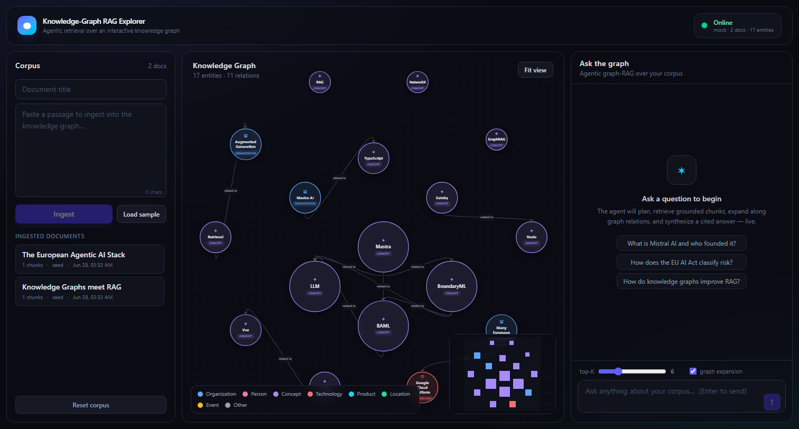
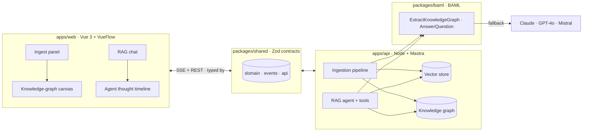

# 🧠 Knowledge-Graph RAG Explorer


> Ingest documents → watch a **knowledge graph** assemble itself on an interactive
> canvas → ask questions and watch an **agent reason** over the graph in real time.



A full-stack, end-to-end showcase of **agentic RAG made transparent**. Drop in
text, and the system chunks it, embeds it, extracts a typed knowledge graph, and
renders it live with **VueFlow**. Ask a question and a **Mastra**-orchestrated
agent plans, retrieves, expands along graph edges, and synthesizes a grounded,
cited answer — streaming every thought to the UI so the "AI thought process" is
visible, not a black box.

Built deliberately on a modern agentic-AI stack: **Vue 3 + TypeScript (strict)**,
**Node.js + TypeScript**, **Mastra AI** for orchestration, **BoundaryML (BAML)**
for typed LLM integration, and **VueFlow** for the canvas.

---

## Why this project

It exercises the exact problems a frontier-AI platform team faces:

| Challenge                                         | How this repo answers it                                                                                                       |
| ------------------------------------------------- | ------------------------------------------------------------------------------------------------------------------------------ |
| **Architecting resilient, event-driven services** | Node/TS API streaming agent + ingestion events over SSE; pluggable, fallback-capable LLM layer                                 |
| **Defining the language between agents & humans** | A single `@kg/shared` package of **Zod schema contracts** consumed by both ends — the protocol can't drift                     |
| **High-craft, canvas-heavy frontend**             | A polished **Vue 3 + VueFlow** knowledge-graph canvas: salience-sized nodes, typed edges, live highlighting                    |
| **Bridging logic & interface**                    | The agent's RAG pipeline (retrieve → graph-expand → synthesize) is streamed step-by-step into a transparent reasoning timeline |
| **Knowledge Graphs + RAG**                        | graphology knowledge graph + vector retrieval + graph expansion (GraphRAG), wired through **BAML** LLM functions               |

## Tech stack

| Layer           | Technology                                                                                                   |
| --------------- | ------------------------------------------------------------------------------------------------------------ |
| Frontend        | **Vue 3** (Composition API, `<script setup>`), **TypeScript strict**, Vite, Pinia, **VueFlow**, Tailwind CSS |
| Backend         | **Node.js + TypeScript** (ESM, strict), Fastify, SSE                                                         |
| Orchestration   | **Mastra AI** (`@mastra/core`) — agent + tools                                                               |
| LLM integration | **BoundaryML / BAML** — typed functions, multi-provider fallback (Claude → GPT-4o → Mistral)                 |
| Knowledge graph | graphology (+ centrality for salience)                                                                       |
| Retrieval       | In-memory vector store (cosine) + graph expansion                                                            |
| Contracts       | **Zod** schemas shared across the stack (`@kg/shared`)                                                       |
| Tooling         | npm workspaces, ESLint (flat), Prettier, Vitest, Docker, GitHub Actions CI                                   |

> **Runs fully offline.** The default `mock` LLM provider gives deterministic
> embeddings, real heuristic entity/relation extraction, and extractive answers —
> so you can clone, install, and demo the whole pipeline with **zero API keys**.
> Set `LLM_PROVIDER=baml` + a key to swap in real models via BAML.

---

## Architecture



The agentic RAG flow streamed to the UI:

```
plan ─▶ retrieve (vector) ─▶ graph-expand (edges) ─▶ rerank ─▶ synthesize (grounded answer + citations)
```

See [`docs/ARCHITECTURE.md`](docs/ARCHITECTURE.md) for the deep dive.

---

## Monorepo layout

```
kg-rag-explorer/
├── apps/
│   ├── api/        # Node + TS + Fastify + Mastra · ingestion, RAG agent, SSE
│   └── web/        # Vue 3 + TS + VueFlow · canvas, chat, thought timeline
├── packages/
│   ├── shared/     # Zod schema contracts (the agent↔human protocol)
│   └── baml/       # BAML LLM function definitions + generated client
├── scripts/        # seed the running API with sample docs
├── docs/           # architecture
└── .github/        # CI
```

## Quickstart

```bash
git clone https://github.com/soneeee22000/Knowledge-Graph-RAG-Explorer.git
cd Knowledge-Graph-RAG-Explorer
npm install

# Terminal 1 — API (offline mock provider, no keys needed)
npm run dev:api          # http://localhost:8000

# Terminal 2 — Web
npm run dev:web          # http://localhost:3000
```

Open the web app, click **Load sample → Ingest**, watch the graph build, then ask
_"What is Mastra built with?"_ and watch the agent reason.

Optional — seed via the API instead of the UI:

```bash
node scripts/seed.mjs
```

### Use real LLMs (via BAML + Mastra)

```bash
export ANTHROPIC_API_KEY=...        # or OPENAI_API_KEY / MISTRAL_API_KEY
npm run baml:generate               # generate the typed BAML client
LLM_PROVIDER=baml npm run dev:api
```

With a key, extraction and answering run the real BAML functions
(`ExtractKnowledgeGraph`, `AnswerQuestion`) with Claude → GPT-4o → Mistral
fallback, and the Mastra agent binds a real model and genuinely calls
`agent.generate(...)` to plan. Offline, the identical
plan → retrieve → graph-expand → rerank → synthesize flow runs deterministically.
Embeddings always use a local deterministic embedder (swap in a real embedding
model for production).

### Docker

```bash
docker compose up --build           # web :3000, api :8000
```

## Scripts

| Command                           | Description                        |
| --------------------------------- | ---------------------------------- |
| `npm run dev`                     | Run API + web together             |
| `npm run build`                   | Build shared → api → web           |
| `npm run typecheck`               | Strict typecheck across workspaces |
| `npm test`                        | Run all Vitest suites              |
| `npm run lint` / `npm run format` | ESLint / Prettier                  |
| `npm run baml:generate`           | Generate the BAML client           |

## Quality gates

Strict TypeScript everywhere · Zod-validated boundaries · Vitest unit + integration
tests · ESLint (flat) + Prettier · CI builds, typechecks, lints, and tests on every
push.

## License

[MIT](LICENSE) © Pyae Sone (Seon) — [github.com/soneeee22000](https://github.com/soneeee22000)
