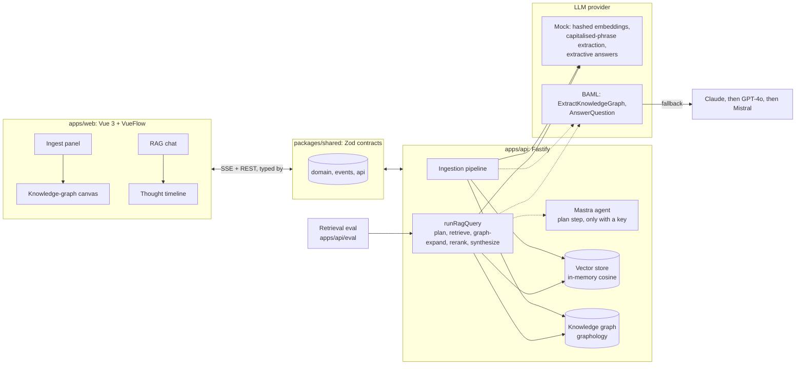

# Knowledge-Graph RAG Explorer

Ingest documents, watch a knowledge graph assemble on an interactive canvas, then ask questions and follow every step of a GraphRAG pipeline as it streams to the browser.

[](https://github.com/soneeee22000/Knowledge-Graph-RAG-Explorer/actions/workflows/ci.yml)
[](package.json)
[](tsconfig.base.json)
[](apps/web/package.json)
[](eslint.config.js)
[](LICENSE)
[](https://github.com/soneeee22000/Knowledge-Graph-RAG-Explorer/commits/main)


[Retrieval evaluation](docs/EVAL.md) · [Architecture](docs/ARCHITECTURE.md) · [Why this exists](docs/WHY.md) · [Deployment steps](docs/DEPLOY.md)

There is no hosted demo yet. The app runs locally with no API keys. The deployment steps are written and checked locally but have not been executed, so no link here points at a running instance.

## Why this exists

**A RAG answer is hard to trust when you cannot see where it came from.** Most pipelines return fluent text but not which passages were used or what happened in between. Adding a knowledge graph adds more hidden steps: extraction, traversal and reranking. Each is a place where the output can drift from the source, or where a step quietly does nothing.

This project streams every stage (plan, retrieve, graph-expand, rerank, synthesize) to the browser as a typed event. It draws the traversed sub-graph on a canvas, and it runs the same pipeline with a deterministic, keyless mock provider, so the behaviour can be pinned down by tests and by a committed evaluation. The full argument is in [docs/WHY.md](docs/WHY.md).

## What it solves

| Layer          | Problem                                                                           | How the project answers it                                                                                                                  |
| -------------- | --------------------------------------------------------------------------------- | ------------------------------------------------------------------------------------------------------------------------------------------- |
| **Contracts**  | Front end and back end drift apart on event and data shapes.                      | One `@kg/shared` package of Zod schemas, used by both apps and validated at the boundaries.                                                 |
| **Ingestion**  | You cannot see how a document turned into chunks, vectors and entities.           | Chunk → embed → extract → link → persist, with each phase streamed as an `IngestEvent` over SSE.                                            |
| **Retrieval**  | Vector search and graph expansion are mixed, so neither can be judged on its own. | Vector retrieval, one-hop graph expansion and a graph rerank are separate, unit-tested functions (`apps/api/src/agents/graphRetrieval.ts`). |
| **Reasoning**  | The steps between the question and the answer are hidden.                         | Each step is streamed as a `ThoughtStep` and drawn as a timeline. Traversed entities are highlighted on a VueFlow canvas.                   |
| **Evaluation** | "Graph helps" gets asserted rather than measured.                                 | An authored 20-question set compares graph-expand with vector-only on the same candidates. The results are committed and diffed by CI.      |

## Architecture


```mermaid
flowchart LR
  subgraph Web["apps/web: Vue 3 + VueFlow"]
    UI["Ingest panel"] --> Canvas["Knowledge-graph canvas"]
    Chat["RAG chat"] --> Timeline["Thought timeline"]
  end

  subgraph Shared["packages/shared: Zod contracts"]
    Contracts[("domain, events, api")]
  end

  subgraph API["apps/api: Fastify"]
    Ingest["Ingestion pipeline"]
    Pipeline["runRagQuery<br/>plan, retrieve, graph-expand, rerank, synthesize"]
    Agent["Mastra agent<br/>plan step, only with a key"]
    VS[("Vector store<br/>in-memory cosine")]
    KG[("Knowledge graph<br/>graphology")]
  end

  subgraph LLM["LLM provider"]
    Mock["Mock: hashed embeddings,<br/>capitalised-phrase extraction,<br/>extractive answers"]
    Baml["BAML: ExtractKnowledgeGraph,<br/>AnswerQuestion"]
  end

  Eval["Retrieval eval<br/>apps/api/eval"] --> Pipeline
  Web <-->|"SSE + REST, typed by"| Shared
  Shared <--> API
  Ingest --> VS
  Ingest --> KG
  Pipeline --> VS
  Pipeline --> KG
  Pipeline -.-> Agent
  Ingest --> Mock
  Pipeline --> Mock
  Ingest -.-> Baml
  Pipeline -.-> Baml
  Baml -->|"fallback"| Models["Claude, then GPT-4o, then Mistral"]
```

Dashed edges are used only when `LLM_PROVIDER=baml` and a key is set. Offline, the same pipeline runs deterministically on the mock provider. The Mastra agent is always constructed, with `retrieve` and `graphExpand` tools. With an Anthropic key, `agent.generate()` writes the plan step. Retrieval, expansion, rerank and synthesis always run in `runRagQuery`. Embeddings always come from the local deterministic embedder, including on the BAML path. More detail is in [docs/ARCHITECTURE.md](docs/ARCHITECTURE.md).

## Features

| Feature              | Where                                                                                                        |
| -------------------- | ------------------------------------------------------------------------------------------------------------ |
| Streaming ingestion  | `POST /api/ingest` (SSE): chunking, embedding, extraction, linking and persisting, each reported as progress |
| Streaming query      | `POST /api/query` (SSE): thought steps, citations, sub-graph, answer tokens, final answer                    |
| Knowledge graph      | graphology: entities deduplicated by type and label, degree-centrality salience, one-hop neighbourhoods      |
| Graph canvas         | VueFlow nodes coloured by entity type and sized by salience, with traversed entities highlighted             |
| Keyless mode         | `LLM_PROVIDER=mock` (the default): deterministic, no network                                                 |
| Real models          | `LLM_PROVIDER=baml` with `ANTHROPIC_API_KEY`; GPT-4o and Mistral fallback legs are optional                  |
| Retrieval evaluation | `npm run eval`: graph-expand vs vector-only on an authored set; CI fails if the results drift                |

## Results

`npm run eval` ingests a fictional 10-document corpus (12 chunks, 51 entities, 68 relations) with the mock provider. It then scores 20 questions written by the repo author (10 single-hop, 10 multi-hop), `topK = 6`:

| Mode         | Hit@1 | Hit@3 | MRR   | All evidence in top-6 |
| ------------ | ----- | ----- | ----- | --------------------- |
| vector-only  | 16/20 | 20/20 | 0.900 | 18/20                 |
| graph-expand | 16/20 | 20/20 | 0.900 | 18/20                 |

**The graph step made no difference.** The top-6 order changed on 0 of 20 questions. The rerank adds +0.15 to any retrieved chunk that contributed an expanded entity, and on every question all six retrieved chunks did, so the boost is uniform and the order stays as vector search returned it. The step can only reorder, never add. The two multi-hop misses are questions whose second evidence chunk was never retrieved, and a reorder cannot fix that.

This is a small, self-authored set on mock embeddings, so it says nothing about retrieval quality on real documents. It does show that the current rerank design is a no-op. Per-kind tables, the method and the caveats are in [docs/EVAL.md](docs/EVAL.md). The committed output is [`apps/api/eval/results.json`](apps/api/eval/results.json).

## Getting started

Requires Node.js 20 or newer (`.nvmrc`). Local runs used Node 24 on Windows 11.

```bash
git clone https://github.com/soneeee22000/Knowledge-Graph-RAG-Explorer.git
cd Knowledge-Graph-RAG-Explorer
npm install

npm run dev:api     # terminal 1: API on http://localhost:8000, mock provider, no keys
npm run dev:web     # terminal 2: web on http://localhost:3000
```

Open the web app, click **Load sample**, then **Ingest**, and ask a question. To seed through the API instead, run `node scripts/seed.mjs` while the API is up.

Run the evaluation and the checks:

```bash
npm run eval          # prints the table and rewrites apps/api/eval/results.json
npm run eval:check    # fails if a fresh run differs from the committed results
npm test
npm run typecheck
npm run lint
npm run build
```

Use real models (this costs money and needs a key):

```bash
export ANTHROPIC_API_KEY=...        # the only key required
# export OPENAI_API_KEY=...         # optional GPT-4o fallback leg
# export MISTRAL_API_KEY=...        # optional Mistral fallback leg
npm run baml:generate
LLM_PROVIDER=baml npm run dev:api
```

Docker: `docker compose up --build` starts the web app on :3000 and the API on :8000 with the mock provider. Deploying to Vercel plus Render or Cloud Run, keyless: see [docs/DEPLOY.md](docs/DEPLOY.md).

CI (`.github/workflows/ci.yml`) installs, generates the BAML client, lints, typechecks, tests, runs `eval:check` and builds, on every push.

## Project structure

```
apps/
  api/                  Fastify API
    src/agents/         runRagQuery pipeline, graphRetrieval (expand + rerank), Mastra agent + tools
    src/services/       chunker, corpus (ingestion), vector store, graph store
    src/llm/            provider interface, mock provider, BAML provider
    src/eval/           retrieval evaluation: dataset schema, metrics, runner, CLI
    eval/               corpus.json, questions.json, results.json
  web/                  Vue 3 + Vite + Pinia + VueFlow front end
packages/
  shared/               Zod contracts shared by both apps
  baml/                 BAML function and client definitions
scripts/seed.mjs        seed a running API with two sample documents
docs/                   ARCHITECTURE, EVAL, DEPLOY, WHY, screenshot
vercel.json             web build for Vercel (prepared, not deployed)
render.yaml             API Blueprint for Render's free plan (prepared, not deployed)
```

## Limitations

- **A portfolio project, not a product.** There is no hosted instance. See [what this is not](docs/WHY.md#what-this-is-not).
- **The graph rerank currently changes nothing.** On the authored set it never reorders the top-k, and by design it cannot add chunks that vector search missed ([docs/EVAL.md](docs/EVAL.md)).
- **The evaluation is small and self-authored.** 20 questions over 12 chunks, written by the same author as the corpus, with no held-out set.
- **Mock embeddings and extraction.** Embeddings are hashed tokens (lexical, not semantic). Entities are capitalised phrases, and relations are same-sentence co-occurrence typed `RELATED_TO`. The BAML path replaces extraction and answering, but not embeddings.
- **The Mastra agent plans only.** With a key it writes the plan text. It does not drive retrieval or synthesis.
- **Single-process, in-memory stores**, persisted as JSON files. Not built for large corpora or more than one instance.
- **No auth, no rate limiting.** `DELETE /api/corpus` is open, and every visitor shares one corpus. Fine locally, not safe for a public deploy as-is ([docs/DEPLOY.md](docs/DEPLOY.md#before-making-it-public)).
- **The BAML path has no evaluation.** The eval runs on the mock provider only.

## Roadmap

1. Let graph expansion **add** candidate chunks from entities reached by the hop, then rerank the union, and re-run the evaluation.
2. A harder evaluation set: more documents than `topK` can cover, with bridge entities that share no words with the question.
3. A read-only demo mode (seed on boot, no custom ingest or delete), then the keyless deploy in [docs/DEPLOY.md](docs/DEPLOY.md).
4. A real embedding model behind the provider interface, evaluated on the same set.

## License

[MIT](LICENSE)

## Author

**Pyae Sone (Seon)** · [github.com/soneeee22000](https://github.com/soneeee22000)
