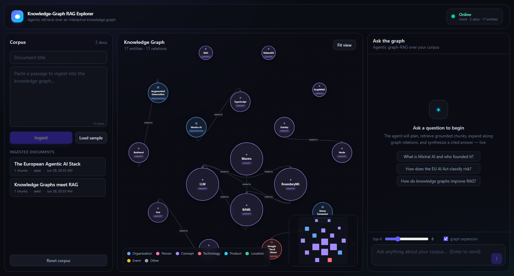
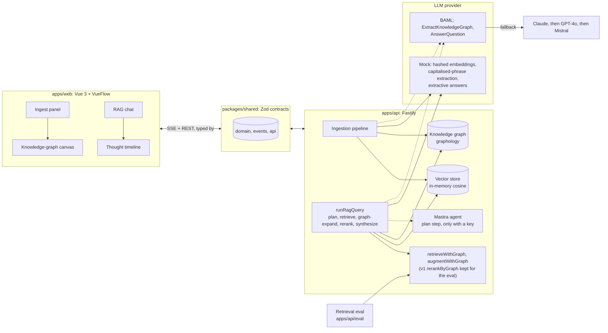

# Knowledge-Graph RAG Explorer

Ingest documents, watch a knowledge graph assemble on an interactive canvas, then ask questions and follow every step of a GraphRAG pipeline as it streams to the browser.

[](https://github.com/soneeee22000/Knowledge-Graph-RAG-Explorer/actions/workflows/ci.yml)
[](package.json)
[](tsconfig.base.json)
[](apps/web/package.json)
[](eslint.config.js)
[](LICENSE)
[](https://github.com/soneeee22000/Knowledge-Graph-RAG-Explorer/commits/main)



[Retrieval evaluation](docs/EVAL.md) · [Architecture](docs/ARCHITECTURE.md) · [Why this exists](docs/WHY.md) · [Deployment steps](docs/DEPLOY.md)

There is no hosted demo yet. The app runs locally with no API keys. A read-only public mode and a one-project Vercel deploy (web app plus API as a Vercel Function) are built and were checked locally, but have not been deployed, so no link here points at a running instance.

## Why this exists

**A RAG answer is hard to trust when you cannot see where it came from.** Most pipelines return fluent text but not which passages were used or what happened in between. Adding a knowledge graph adds more hidden steps: extraction, traversal and reranking. Each is a place where the output can drift from the source, or where a step quietly does nothing.

This project streams every stage (plan, retrieve, graph-expand, rerank, synthesize) to the browser as a typed event. It draws the traversed sub-graph on a canvas, and it runs the same pipeline with a deterministic, keyless mock provider, so the behaviour can be pinned down by tests and by a committed evaluation. The full argument is in [docs/WHY.md](docs/WHY.md).

## What it solves

| Layer          | Problem                                                                           | How the project answers it                                                                                                                                                        |
| -------------- | --------------------------------------------------------------------------------- | --------------------------------------------------------------------------------------------------------------------------------------------------------------------------------- |
| **Contracts**  | Front end and back end drift apart on event and data shapes.                      | One `@kg/shared` package of Zod schemas, used by both apps and validated at the boundaries.                                                                                       |
| **Ingestion**  | You cannot see how a document turned into chunks, vectors and entities.           | Chunk → embed → extract → link → persist, with each phase streamed as an `IngestEvent` over SSE.                                                                                  |
| **Retrieval**  | Vector search and graph expansion are mixed, so neither can be judged on its own. | Vector retrieval and graph-augmented retrieval (expansion adds candidates, then a rerank) are separate, unit-tested functions (`apps/api/src/agents/graphRetrieval.ts`).          |
| **Reasoning**  | The steps between the question and the answer are hidden.                         | Each step is streamed as a `ThoughtStep` and drawn as a timeline. Traversed entities are highlighted on a VueFlow canvas.                                                         |
| **Evaluation** | "Graph helps" gets asserted rather than measured.                                 | Authored question sets compare vector-only, the original graph step and the rebuilt one. The results are committed and diffed by CI, including where the graph step did not help. |

## Architecture


```mermaid
flowchart LR
  subgraph Web["apps/web: Vue 3 + VueFlow"]
    UI["Ingest panel"] --> Canvas["Knowledge-graph canvas"]
    Chat["RAG chat"] --> Timeline["Thought timeline"]
  end

  subgraph Shared["packages/shared: Zod contracts"]
    Contracts[("domain, events, api")]
  end

  subgraph API["apps/api: Fastify"]
    Ingest["Ingestion pipeline"]
    Pipeline["runRagQuery<br/>plan, retrieve, graph-expand, rerank, synthesize"]
    Helpers["retrieveWithGraph, augmentWithGraph<br/>(v1 rerankByGraph kept for the eval)"]
    Agent["Mastra agent<br/>plan step, only with a key"]
    VS[("Vector store<br/>in-memory cosine")]
    KG[("Knowledge graph<br/>graphology")]
  end

  subgraph LLM["LLM provider"]
    Mock["Mock: hashed embeddings,<br/>capitalised-phrase extraction,<br/>extractive answers"]
    Baml["BAML: ExtractKnowledgeGraph,<br/>AnswerQuestion"]
  end

  Eval["Retrieval eval<br/>apps/api/eval"] --> Helpers
  Pipeline --> Helpers
  Web <-->|"SSE + REST, typed by"| Shared
  Shared <--> API
  Ingest --> VS
  Ingest --> KG
  Pipeline --> VS
  Pipeline --> KG
  Pipeline -.-> Agent
  Ingest --> Mock
  Pipeline --> Mock
  Ingest -.-> Baml
  Pipeline -.-> Baml
  Baml -->|"fallback"| Models["Claude, then GPT-4o, then Mistral"]
```

Dashed edges are used only when `LLM_PROVIDER=baml` and a key is set. Offline, the same pipeline runs deterministically on the mock provider. The Mastra agent is always constructed, with `retrieve` and `graphExpand` tools. With an Anthropic key, `agent.generate()` writes the plan step. Retrieval, expansion, rerank and synthesis always run in `runRagQuery`. Embeddings always come from the local deterministic embedder, including on the BAML path. More detail is in [docs/ARCHITECTURE.md](docs/ARCHITECTURE.md).

## Features

| Feature              | Where                                                                                                        |
| -------------------- | ------------------------------------------------------------------------------------------------------------ |
| Streaming ingestion  | `POST /api/ingest` (SSE): chunking, embedding, extraction, linking and persisting, each reported as progress |
| Streaming query      | `POST /api/query` (SSE): thought steps, citations, sub-graph, answer tokens, final answer                    |
| Knowledge graph      | graphology: entities deduplicated by type and label, degree-centrality salience, one-hop neighbourhoods      |
| Graph canvas         | VueFlow nodes coloured by entity type and sized by salience, with traversed entities highlighted             |
| Keyless mode         | `LLM_PROVIDER=mock` (the default): deterministic, no network                                                 |
| Read-only demo mode  | `DEMO_READONLY=1`: sample seeded on boot, ingest and delete refused (403), per-IP rate limit                 |
| Real models          | `LLM_PROVIDER=baml` with `ANTHROPIC_API_KEY`; GPT-4o and Mistral fallback legs are optional                  |
| Retrieval evaluation | `npm run eval`: vector-only vs two graph steps on authored sets; CI fails if the results drift               |

## Results

`npm run eval` ingests a fictional 10-document corpus (12 chunks, 51 entities, 68 relations) with the mock provider. It scores questions authored for this repo with `topK = 6`, in three modes built from one vector ranking:

| Question set                                      | Mode                 | Hit@1 | Hit@3 | MRR   | All evidence in top-6 |
| ------------------------------------------------- | -------------------- | ----- | ----- | ----- | --------------------- |
| Original 20 (10 single-hop, 10 multi-hop)         | vector-only          | 16/20 | 20/20 | 0.900 | 18/20                 |
|                                                   | graph-expand (v1)    | 16/20 | 20/20 | 0.900 | 18/20                 |
|                                                   | graph-augmented (v2) | 15/20 | 20/20 | 0.875 | 18/20                 |
| Post-fix 8 multi-hop (written after v2, separate) | vector-only          | 6/8   | 8/8   | 0.875 | 6/8                   |
|                                                   | graph-expand (v1)    | 6/8   | 8/8   | 0.875 | 6/8                   |
|                                                   | graph-augmented (v2) | 6/8   | 8/8   | 0.875 | 6/8                   |

**The story so far, including the parts that did not work:**

1. **v1 was a no-op.** The original graph step only reordered the six retrieved chunks, adding +0.15 to any chunk that contributed an expanded entity. Every chunk did, so the order never changed: 0 of 20 questions.
2. **v2 was rebuilt so expansion can add chunks.** Seed entities come from the top 3 chunks. One hop out, every chunk mentioning a reached entity joins the candidates. The union is reranked by vector score plus a graph support term (seed score x 0.5^hop / number of chunks mentioning the entity), then cut back to 6. Unit and integration tests show a chunk that vector search missed reaching the answer this way.
3. **On this corpus v2 changes retrieval but does not improve it.** It reordered the top 6 on 17 of 20 questions and changed which chunks were in it on 12, but recovered neither missing evidence chunk (`m01`, `m03`), and moved one first-relevant chunk from rank 1 to rank 2, so MRR fell from 0.900 to 0.875.
4. **Eight more multi-hop questions** were written after that, to check whether the original set simply could not show a difference. They are reported separately. All three modes score the same on them.
5. **The likely cause is the mock graph.** Co-occurrence edges connect almost every chunk to the seeds, so graph support comes out nearly the same for every chunk. The extractor also turns "Series 40" and "Series 22" into one hub entity, "Series", which erases the bridge the multi-hop questions depend on.

This is a small, self-authored set on mock embeddings and mock extraction. It says nothing about retrieval quality on real documents. The method, the scoring rule, per-kind tables and the diagnosis are in [docs/EVAL.md](docs/EVAL.md). The committed outputs are [`results.json`](apps/api/eval/results.json) and [`results-postfix.json`](apps/api/eval/results-postfix.json), and CI fails if a fresh run differs from either.

## Getting started

Requires Node.js 20 or newer (`.nvmrc`). Local runs used Node 24 on Windows 11.

```bash
git clone https://github.com/soneeee22000/Knowledge-Graph-RAG-Explorer.git
cd Knowledge-Graph-RAG-Explorer
npm install

npm run dev:api     # terminal 1: API on http://localhost:8000, mock provider, no keys
npm run dev:web     # terminal 2: web on http://localhost:3000
```

Open the web app, click **Load sample**, then **Ingest**, and ask a question. To seed through the API instead, run `node scripts/seed.mjs` while the API is up.

Run the evaluation and the checks:

```bash
npm run eval          # prints both tables and rewrites results.json and results-postfix.json
npm run eval:check    # fails if a fresh run differs from either committed file
npm test
npm run typecheck
npm run lint
npm run build
```

Use real models (this costs money and needs a key):

```bash
export ANTHROPIC_API_KEY=...        # the only key required
# export OPENAI_API_KEY=...         # optional GPT-4o fallback leg
# export MISTRAL_API_KEY=...        # optional Mistral fallback leg
npm run baml:generate
LLM_PROVIDER=baml npm run dev:api
```

Docker: `docker compose up --build` starts the web app on :3000 and the API on :8000 with the mock provider.

To try the public read-only mode locally: `DEMO_READONLY=1 npm run dev:api`. The API seeds the rail sample, refuses ingest and delete, and rate-limits per IP. Deployment steps (one Vercel project, or Render as a fallback) are in [docs/DEPLOY.md](docs/DEPLOY.md).

CI (`.github/workflows/ci.yml`) installs, generates the BAML client, lints, typechecks, tests, runs `eval:check` and builds, on every push.

## Project structure

```
apps/
  api/                  Fastify API
    src/agents/         runRagQuery pipeline, graphRetrieval (graph-augmented retrieval), Mastra agent + tools
    src/demo/           read-only demo: sample seeding, per-IP rate limiter
    src/vercel.ts       Node handler for the Vercel Function (always read-only)
    src/services/       chunker, corpus (ingestion), vector store, graph store
    src/llm/            provider interface, mock provider, BAML provider
    src/eval/           retrieval evaluation: dataset schema, metrics, runner, CLI
    eval/               corpus.json, questions.json, questions-postfix.json, results*.json
  web/                  Vue 3 + Vite + Pinia + VueFlow front end
packages/
  shared/               Zod contracts shared by both apps
  baml/                 BAML function and client definitions
api/[...path].ts        Vercel Function entry: re-exports apps/api/src/vercel.ts
scripts/seed.mjs        seed a running API with two sample documents
docs/                   ARCHITECTURE, EVAL, DEPLOY, WHY, screenshot
vercel.json             web build for Vercel; the api/ function deploys with it (prepared, not deployed)
render.yaml             fallback API Blueprint for Render's free plan, read-only (prepared, not deployed)
```

## Limitations

- **A portfolio project, not a product.** There is no hosted instance. See [what this is not](docs/WHY.md#what-this-is-not).
- **The graph step does not improve retrieval on the evaluation data.** The rebuilt step adds and reranks candidates, but on the authored sets it recovered no missing evidence and cost one Hit@1. The mock graph is the likely cause ([docs/EVAL.md](docs/EVAL.md)).
- **The evaluation is small and self-authored.** 28 questions over 12 chunks, written by the same author as the corpus, with no held-out set. The 8 post-fix questions were written knowing how the rebuilt graph step works.
- **Mock embeddings and extraction.** Embeddings are hashed tokens (lexical, not semantic). Entities are capitalised phrases, and relations are same-sentence co-occurrence typed `RELATED_TO`. The BAML path replaces extraction and answering, but not embeddings.
- **The Mastra agent plans only.** With a key it writes the plan text. It does not drive retrieval or synthesis.
- **Single-process, in-memory stores**, persisted as JSON files. Not built for large corpora or more than one instance.
- **No auth.** Locally, `DELETE /api/corpus` is open and every client shares one corpus. A public instance must use `DEMO_READONLY=1`, which refuses writes. Its rate limit is in-memory per instance, a courtesy limit rather than real abuse protection ([docs/DEPLOY.md](docs/DEPLOY.md)).
- **The BAML path has no evaluation.** The eval runs on the mock provider only.

## Roadmap

1. A sparser, typed graph (an LLM extractor, or at least dropping one-word noise entities and keeping "Series 40" apart from "Series 22"), then re-run the evaluation to see whether graph support stops being uniform.
2. A larger corpus than `topK` can mostly cover, with bridge entities that share no words with the question.
3. Execute the keyless deploy in [docs/DEPLOY.md](docs/DEPLOY.md) and verify the public URL.
4. A real embedding model behind the provider interface, evaluated on the same sets.

## License

[MIT](LICENSE)

## Author

**Pyae Sone (Seon)** · [github.com/soneeee22000](https://github.com/soneeee22000)
